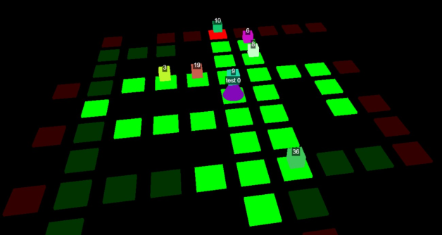

# ASAP

## Table of contents
- [ASAP](#asap)
  - [Table of contents](#table-of-contents)
  - [Project Overview](#project-overview)
  - [Project Layout](#project-layout)
  - [Installation](#installation)
  - [Running the Project](#running-the-project)
- [Contacts](#contacts)

## Project Overview
This project is part of the "Autonomous Software Agents" master course. The goal is to develop an autonomous agent using the Belief-Desire-Intention (BDI) architecture, capable of playing a game that involves picking up and delivering parcels. The agent interacts with the game environment via the API provided by the [Deliveroo.js](https://github.com/unitn-ASA/DeliverooAgent.js) project.

<p align="center">
  
</p>

## Project Layout

```plaintext
ASAP/
├── belief/
│   ├── agentData.js           # To store information about agent(s)
│   ├── belief.js              # General beliefs management
│   ├── map.js                 # To store information about the map
│   ├── utilsBelief.js         # All functions utils for belief
|
├── coordination/
│   ├── coordination.js        # Handles messages with other agents 
|
├── intention&revision/
│   ├── agent.js               # Handle agent loop intention
│   ├── intention.js           # Handle intention execution
│   ├── options.js             # Handle optionsLoop to choose best option
│   ├── utilsOptions.js        # All functions utils to choose best option and calculate utilities
|
├── planner/
│   ├── domain.pddl/           # Domain for PDDL
│   ├── plans.js               # All possible plans
│   ├── utils_planner.js       # All function utils for plans (ex. BFS)
|
├── config.js                  # Configuration parameters
├── index.js                   # For running the agent
└── socketConnection.js        # Create client instantation
```

## Installation

1. **Clone the repository:**
   ```
   git clone https://github.com/Roman-Simone/ASA_Project.git
   ```

2. **Install dependencies:**
   ```sh
   npm install
   ```

3. **Set up Docker environment for PDDL:**
   In case you want to have PDDL solution locally follow the instructions in the [Planutils Server Environment](https://github.com/AI-Planning/planutils/tree/main/environments/server) to set up the Docker environment required for the PDDL planners (otherwise don't do anything).

   Then, you need to go to ```node_modules/@unitn-asa/pddl-client/src/PddlOnlineSolver.js```. Here you are going to change the parameters to the following:
    
    ```bash
    const HOST = "http://localhost:5001"
    const PATH = "/package/dual-bfws-ffparser/solve"
    ```

## Running the Project

The program have two modalities:
1. SingleAgent where there is only one agent in game, in order to launch this modalities run:

    ```bash
    node index.js ONE agent_1
    ```
2. MultiAgents where there is two agents in game (one MASTER and one SLAVE), in order to launch this modalities run:

    ```bash
    node index.js TWO agent_1
    node index.js TWO agent_2
    ```

# Contacts

Simone Roman - [simone.roman@studenti.unitn.it](mailto:simone.roman@studenti.unitn.it)

Stefano Bonetto - [stefano.bonetto@studenti.unitn.it](mailto:stefano.bonetto@studenti.unitn.it)

<a href="https://www.unitn.it/"></a>
